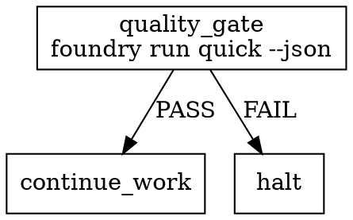

# Foundry Integration Guide

How PAS pipelines and Reckoner agents consume Foundry output.

## Reading result.json

```python
import json, subprocess
result = subprocess.run(['foundry', 'run', 'quick', '--json'], capture_output=True, text=True)
data = json.loads(result.stdout)
if data['agent_recommendation']['safe_to_continue']:
    # proceed to next step
    pass
else:
    reason = data['agent_recommendation']['summary']
    # halt or escalate
```

## PAS Pipeline Node Pattern



## Reckoner Gate Pattern

```yaml
steps:
  - name: foundry_gate
    run: foundry run quick --json
    gate:
      pass:
        condition: safe_to_continue == true
        field: agent_recommendation.safe_to_continue
      fail:
        condition: safe_to_continue == false
        field: agent_recommendation.safe_to_continue
        message: "{{ agent_recommendation.summary }}"
```

## Environment Requirements

- `foundry` binary on PATH
- `ANTHROPIC_API_KEY` environment variable set (only required for `foundry explain`, not for `foundry run`)
- For non-CWD repos: pass `--repo <path>` flag to `foundry run`
